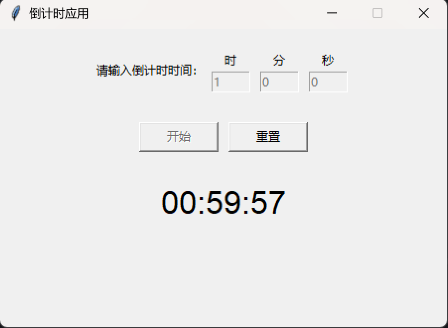

# 倒计时应用

这是一个使用Python和Tkinter开发的简单倒计时应用。

## 功能特点

- 用户可以输入倒计时时间（时 分 秒）
- 点击"开始"按钮后，程序开始倒计时，并实时显示剩余时间
- 倒计时结束后，弹出消息框提示用户
- 可以随时通过"重置"按钮停止并重置倒计时

## 界面截图


## 使用方法

1. 在输入框中输入倒计时时间（时 分 秒）
2. 点击"开始"按钮启动倒计时
3. 倒计时过程中可以点击"重置"按钮停止并重置倒计时

## 文件说明

- `countdown.py` - 主程序文件，包含GUI界面和倒计时逻辑

## 打包为可执行文件

本应用可以使用PyInstaller打包为独立的可执行文件(.exe)，方便在没有Python环境的计算机上运行。

### 安装PyInstaller

```
pip install pyinstaller
```

### 打包命令

```
pyinstaller --onefile countdown.py
```

打包完成后，可执行文件将位于`dist`目录中。

### 打包选项说明

- `--onefile`: 将应用打包为单个可执行文件
- `--windowed` 或 `-w`: 可选参数，用于隐藏控制台窗口
- `--icon=图标路径.ico`: 可选参数，为应用添加自定义图标

完整打包命令示例：

带图标打包命令：
```
pyinstaller --onefile --windowed --icon=icon.ico countdown.py
```

不带图标打包命令：
```
pyinstaller --onefile --windowed countdown.py
```

## 系统要求

- Python 3.6 或更高版本
- Tkinter (Python标准库，通常随Python一起安装)

## 许可

本项目使用MIT许可证。